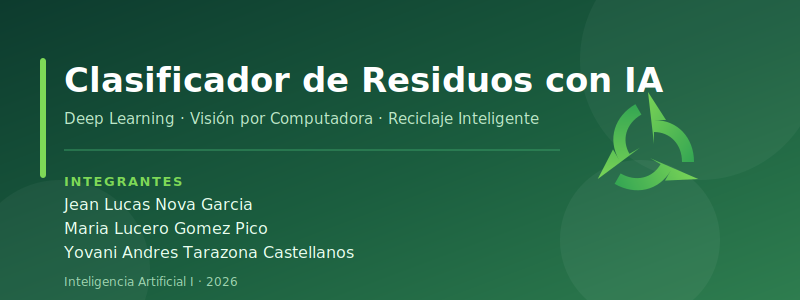

# Clasificador de Residuos con IA

## Autores
Jean Lucas Nova Garcia, Maria Lucero Gomez Pico, Yovani Andres Tarazona Castellanos

## Objetivo
Clasificar automáticamente imágenes de residuos en seis categorías (vidrio, papel, cartón, plástico, metal y orgánico) mediante técnicas de visión por computadora y aprendizaje automático para apoyar el reciclaje inteligente.

## Dataset
**Garbage Classification v2** (sumn2u) — Kaggle.
Enlace de descarga: https://www.kaggle.com/datasets/sumn2u/garbage-classification-v2

## Modelos
HOG, Histograma de color, Gaussian Naive Bayes, Árbol de Decisión, Random Forest, SVM, Regresión Logística, DNN (MLP), CNN, PCA, t-SNE, SelectKBest, K-Means, Clustering Aglomerativo (Ward), DBSCAN.

## Enlaces
- **Código (notebook):
- **Video (YouTube):
- **Repositorio:** https://github.com/JeanLucas20/Clasificadora-residuos-ia
